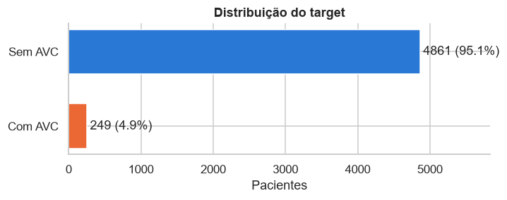

# Dataset

## Contexto

Segundo a Organização Mundial da Saúde, o AVC (acidente vascular cerebral) é a segunda maior causa de morte no mundo, responsável por cerca de 11% dos óbitos. Identificar pacientes com risco elevado permite agir antes que o evento aconteça, e é isso que o dataset propõe: prever, a partir de características do paciente, se ele teve AVC.

O [Stroke Prediction Dataset](https://www.kaggle.com/datasets/fedesoriano/stroke-prediction-dataset) foi publicado no Kaggle por fedesoriano. A fonte original é confidencial e o autor permite apenas uso educacional. Por isso o CSV não é versionado neste repositório: ele é baixado do Kaggle na primeira execução.

## Dimensões

- **5.110 pacientes** (linhas), um por linha, sem duplicatas.
- **12 colunas:** um identificador, 10 features e o target.
- Formulação: **classificação binária**, target stroke (1 = teve AVC).

## Dicionário de dados

| Coluna | Tipo | O que é | Valores possíveis |
|---|---|---|---|
| id | identificador | código do paciente | número inteiro, único por linha; não descreve o paciente e é descartado |
| gender | categórica | gênero | Male (masculino), Female (feminino), Other (outro) |
| age | numérica | idade em anos | 0,08 a 82; bebês têm idade fracionária (0,08 = 1 mês) |
| hypertension | categórica/numérica | diagnóstico de hipertensão | 0 (não tem), 1 (tem) |
| heart_disease | categórica/numérica | diagnóstico de doença cardíaca | 0 (não tem), 1 (tem) |
| ever_married | categórica | se já foi casado(a) alguma vez | Yes (sim), No (não) |
| work_type | categórica | tipo de trabalho | Private (setor privado), Self-employed (autônomo), Govt_job (funcionário público), children (criança, não trabalha), Never_worked (nunca trabalhou) |
| Residence_type | categórica | tipo de área onde mora | Urban (urbana), Rural (rural) |
| avg_glucose_level | numérica | nível médio de glicose no sangue, em mg/dL | 55 a 272 |
| bmi | numérica | índice de massa corporal, em kg/m² | 10 a 98; 201 valores ausentes |
| smoking_status | categórica | histórico de tabagismo | never smoked (nunca fumou), formerly smoked (ex-fumante), smokes (fuma), Unknown (informação indisponível) |
| stroke | categórica/numérica | **target**: se o paciente teve AVC | 0 (não teve), 1 (teve) |

### Tipos de variável

O tipo que o pandas atribui não é o mesmo que a natureza da variável, e é a natureza que orienta o tratamento. Numérica é uma quantidade contínua; categórica é um rótulo sem ordem; categórica/numérica é uma categoria já codificada como 0 ou 1, que parece número mas não é uma quantidade.

| Tipo | Colunas | Tratamento |
|---|---|---|
| numérica | age, avg_glucose_level, bmi | estatísticas descritivas, outliers, padronização |
| categórica/numérica (0/1) | hypertension, heart_disease | já prontas para a modelagem; não são padronizadas |
| categórica | gender, ever_married, work_type, Residence_type, smoking_status | frequências, one-hot encoding |
| target (categórica/numérica) | stroke | estratificação do split, métricas para classe rara |

## Qualidade dos dados

### Valores ausentes

Só o IMC tem nulos explícitos: **201 pacientes (3,9%)**. A ausência não é aleatória:

| IMC | Pacientes | Casos de AVC | Taxa de AVC |
|---|---|---|---|
| presente | 4.909 | 209 | 4,3% |
| ausente | 201 | 40 | **19,9%** |

Quem não tem IMC registrado tem mais de quatro vezes a taxa de AVC dos demais, e 40 dos 249 casos (16%) estão nesse grupo. Remover essas linhas jogaria fora uma parte relevante da classe rara e apagaria um sinal útil.

Há também uma ausência disfarçada de categoria: o tabagismo desconhecido (Unknown) aparece em **1.544 pacientes (30%)**. Como mostra a [análise exploratória](eda.md#tabagismo), ele concentra as crianças, para quem a pergunta não se aplica.

### Inconsistências e categorias raras

| Verificação | Ocorrências | Decisão |
|---|---|---|
| idade fracionária | 115 | são bebês registrados em meses (0,08 a 1,88 anos); não é erro |
| já casou com menos de 18 anos | 0 | — |
| criança (work_type) com 18 anos ou mais | 0 | — |
| fuma ou fumou com menos de 12 anos | 6 | poucos casos; mantidos |
| IMC acima de 60 | 13 | implausíveis (chega a 97,6); serão limitados a 60 |
| AVC antes dos 20 anos | 2 | raro, mas possível; mantidos |
| gênero Other | 1 | um único paciente; removido antes do split |
| nunca trabalhou (Never_worked) | 22 | rara, mas mantida como categoria |
| linhas duplicadas | 0 | — |

### Desbalanceamento

Só **249 pacientes (4,9%)** tiveram AVC. Isso tem três consequências para o projeto:

- o split treino/teste é **estratificado**, para os dois conjuntos manterem a mesma proporção;
- a **acurácia não serve** como métrica: prever sempre "sem AVC" acerta 95,1%;
- na modelagem, a avaliação deve usar recall, precisão, F1 e PR-AUC da classe positiva, com técnicas como class_weight.

## Split treino e teste

Antes de qualquer análise que possa influenciar decisões, o dataset é dividido em **80% treino (4.087 pacientes, 199 casos de AVC) e 20% teste (1.022 pacientes, 50 casos)**, estratificado pelo target e com semente fixa (random_state = 42). Toda a análise exploratória e todo o ajuste do pré-processamento usam apenas o treino; o teste fica reservado para a avaliação final do modelo. Os dois conjuntos ficam salvos em data/processed (train.csv e test.csv) e são reutilizados pelo notebook de pré-processamento.
