# Análise exploratória

Resultados das tarefas 1 a 3 da APS1. O código completo está no [notebook 01](https://github.com/mthperera/APS-ML/blob/main/notebooks/01_eda.ipynb). Todas as análises abaixo usam **somente o conjunto de treino** (4.087 pacientes, 199 casos de AVC); o teste não é olhado.

Convenção de cores dos gráficos: **azul** é paciente sem AVC, **laranja** é paciente com AVC (ou taxa de AVC) e **violeta** é o treino inteiro. Como o target é desbalanceado, as comparações entre grupos usam a **taxa de AVC** (% do grupo que teve AVC), não a contagem de casos.

## Tarefa 1 — Carregamento e inspeção inicial

O que foi feito, com os resultados detalhados na página [Dataset](dataset.md):

- descrição de cada feature e de seus valores possíveis;
- verificação de dimensões (5.110 × 12), tipos de dado e valores únicos;
- valores ausentes (só o IMC, 3,9%), ausência disfarçada (tabagismo desconhecido, 30%), duplicatas (nenhuma) e regras de consistência entre colunas;
- desbalanceamento do target (4,9% de AVC);
- split 80/20 estratificado, feito antes das demais análises para evitar vazamento de informação do teste.

## Tarefa 2 — Análise univariada

### Estatísticas descritivas

| Variável | Média | Mediana | Desvio padrão | Mínimo | Máximo | Assimetria |
|---|---|---|---|---|---|---|
| Idade (anos) | 43,26 | 45,00 | 22,64 | 0,08 | 82,00 | −0,14 |
| Glicose média (mg/dL) | 105,90 | 91,89 | 44,68 | 55,22 | 271,74 | 1,58 |
| IMC (kg/m²) | 28,88 | 28,10 | 7,90 | 10,30 | 97,60 | 1,12 |

A idade é simétrica. Glicose e IMC têm cauda à direita: a média fica acima da mediana e a assimetria é positiva, mais forte na glicose. As escalas são muito diferentes (idade até 82, glicose até 272), o que vai exigir padronização.

Outliers pelo critério IQR (valores além de 1,5 vez o intervalo interquartil): idade 0, glicose 489 (12% do treino), IMC 86 (2,2%).

### Idade

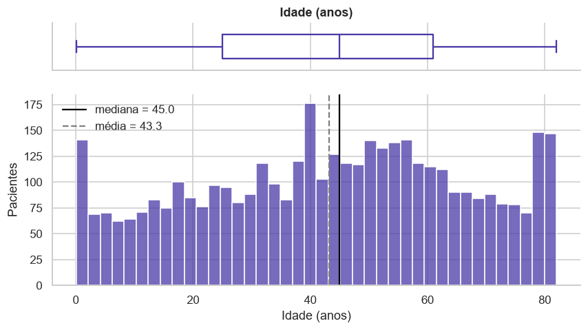

Cobre toda a faixa de 0 a 82 anos, sem outliers. Há um acúmulo de bebês com menos de 2 anos e um pico em 80–82 anos, que sugere idades maiores registradas como 82. Não precisa de tratamento.

### Glicose

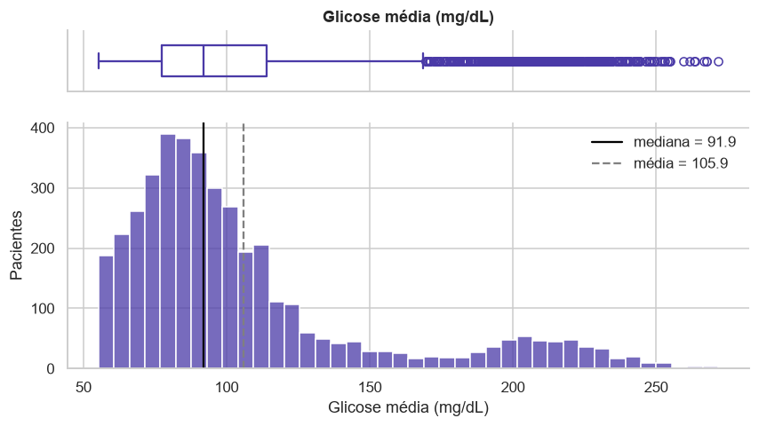

Distribuição **bimodal**: a maioria dos pacientes fica entre 60 e 130, e há um segundo grupo em torno de 200, compatível com diabetes. Os 489 outliers são exatamente esse grupo, e a taxa de AVC entre eles é de **13,5%**, o triplo da taxa geral. Removê-los apagaria um sinal de risco; a decisão é mantê-los e reduzir a assimetria com transformação logarítmica.

### IMC

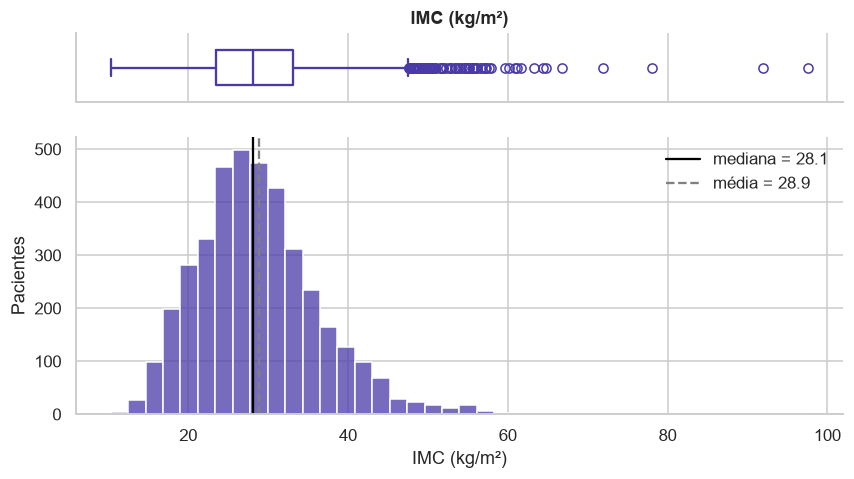

Quase simétrico em torno de 28, com cauda à direita. Dos 86 outliers, 12 passam de 60 (até 97,6) e são provavelmente erros de registro. Os 34 valores abaixo de 15 são de crianças (idade mediana de 4,5 anos) e são plausíveis. A decisão é limitar os valores extremos a 60, sem remover pacientes.

### Variáveis categóricas

| Variável | Categoria | Pacientes | % |
|---|---|---|---|
| hypertension | 0 / 1 | 3.700 / 387 | 90,5 / 9,5 |
| heart_disease | 0 / 1 | 3.855 / 232 | 94,3 / 5,7 |
| gender | Female / Male | 2.397 / 1.690 | 58,6 / 41,4 |
| ever_married | Yes / No | 2.697 / 1.390 | 66,0 / 34,0 |
| work_type | Private / Self-employed / children / Govt_job / Never_worked | 2.324 / 664 / 555 / 528 / 16 | 56,9 / 16,2 / 13,6 / 12,9 / 0,4 |
| Residence_type | Urban / Rural | 2.054 / 2.033 | 50,3 / 49,7 |
| smoking_status | never smoked / Unknown / formerly smoked / smokes | 1.520 / 1.236 / 715 / 616 | 37,2 / 30,2 / 17,5 / 15,1 |

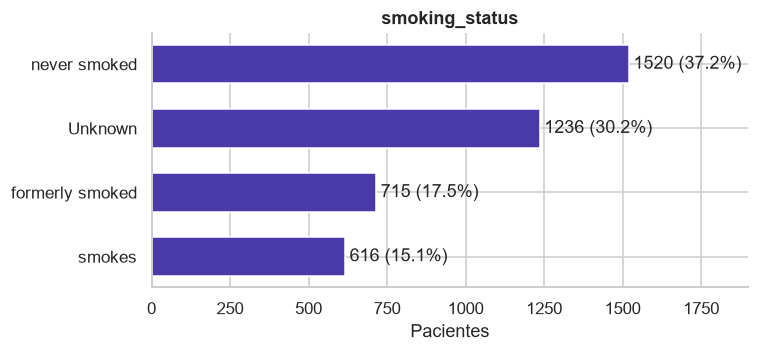

O status desconhecido é a segunda categoria mais frequente (30%). Imputar pela moda transformaria um terço dos pacientes em não fumantes, então a categoria será mantida.

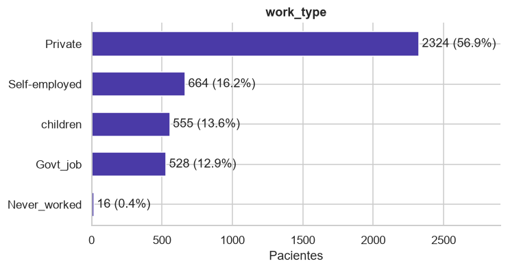

Mais da metade dos pacientes trabalha no setor privado. A categoria de crianças descreve idade, não profissão; quem nunca trabalhou são só 16 pacientes, poucos para estimar uma taxa confiável.

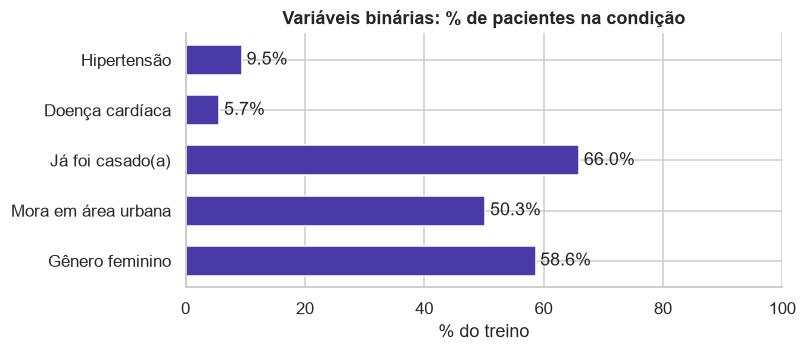

Hipertensão (9,5%) e doença cardíaca (5,7%) são minoritárias. Residência é meio a meio, há leve maioria feminina e dois terços já foram casados. Nenhuma categoria é rara demais para virar uma coluna 0/1.

## Tarefa 3 — Análise bivariada e multivariada

### Correlações entre variáveis numéricas

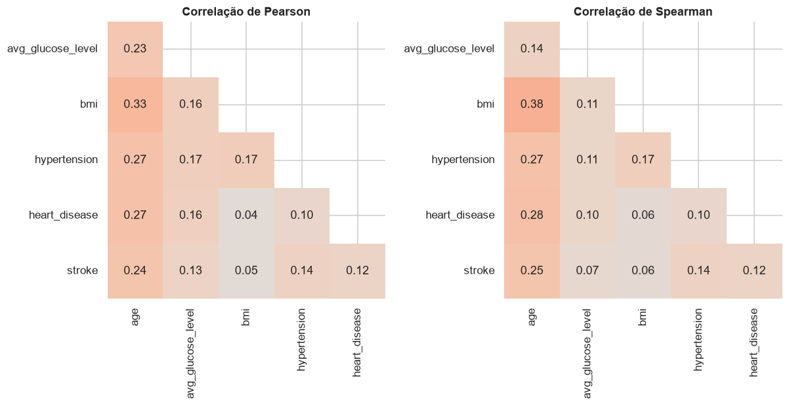

Pearson mede relação linear; Spearman usa a ordem dos valores e é robusta a outliers. Comparar as duas mostra quais correlações dependem dos extremos.

- **Não há correlação forte entre features:** o maior valor é 0,33 (idade e IMC), então não há multicolinearidade.
- **A idade é a variável mais associada ao AVC** (0,24), seguida de hipertensão (0,14), glicose (0,13) e doença cardíaca (0,12). O IMC quase não se relaciona (0,05).
- **A idade se correlaciona com quase todas as outras variáveis** (hipertensão 0,27, doença cardíaca 0,27, IMC 0,33), o que a torna uma provável confundidora.
- **Em Spearman, a correlação de glicose com AVC cai de 0,13 para 0,07:** a associação vem do grupo com glicose muito alta, não de um aumento gradual.

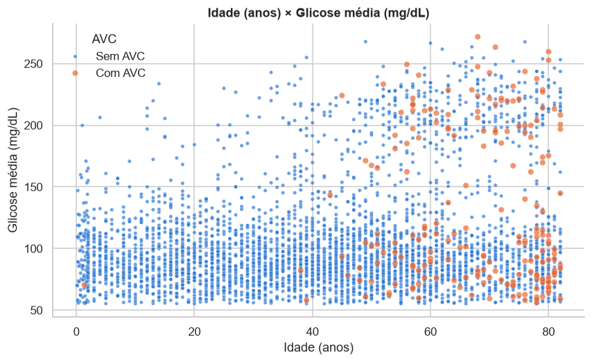

Os casos de AVC quase não aparecem antes dos 40 anos (3 dos 199) e se concentram a partir dos 60. A faixa de glicose acima de 170 tem mais AVC mesmo entre idosos. As classes se sobrepõem muito: nenhuma fronteira simples as separa.

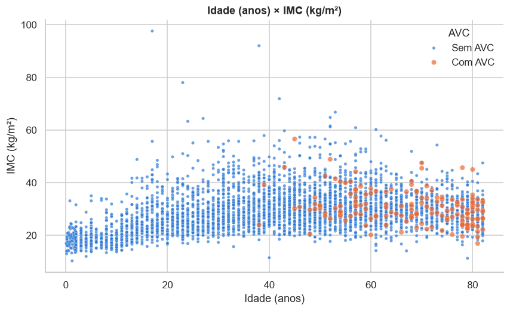

O IMC cresce com a idade só até a adolescência; entre adultos a correlação é praticamente zero (0,03). Os casos de AVC se espalham por toda a faixa usual de IMC.

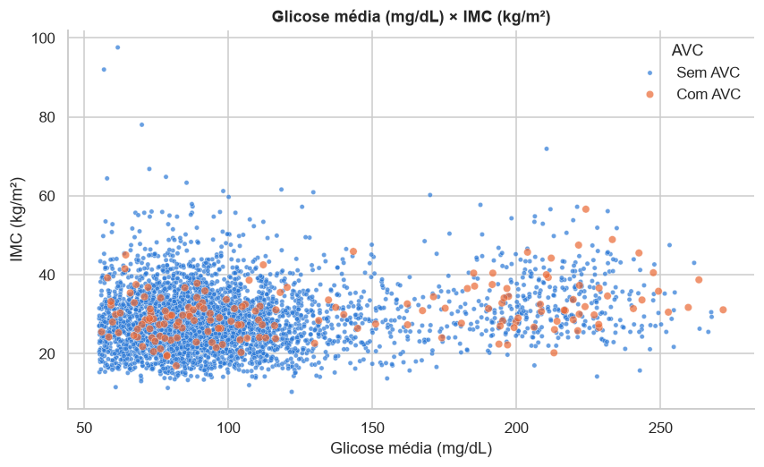

Glicose e IMC quase não se relacionam (correlação de 0,16): o grupo de glicose alta tem IMC espalhado por toda a faixa. Os casos de AVC aparecem nos dois grupos de glicose e em qualquer IMC, então as duas variáveis juntas não formam uma fronteira clara.

### Variáveis categóricas × target

Taxa de AVC de cada categoria e força da associação com o target, medida pelo teste qui-quadrado e pelo V de Cramér (0 = nenhuma associação, 1 = associação perfeita):

| Variável | Taxa de AVC por categoria | V de Cramér | p-valor |
|---|---|---|---|
| hypertension | sem 3,9% · com **14,0%** | 0,135 | < 0,001 |
| heart_disease | sem 4,2% · com **15,5%** | 0,119 | < 0,001 |
| ever_married | nunca casou 1,7% · já casou 6,5% | 0,106 | < 0,001 |
| work_type | crianças 0,2% · nunca trabalhou 0,0% · privado 4,9% · público 5,3% · autônomo 8,3% | 0,104 | < 0,001 |
| smoking_status | desconhecido 3,1% · nunca fumou 4,7% · fuma 5,5% · ex-fumante 7,8% | 0,075 | < 0,001 |
| Residence_type | rural 4,5% · urbana 5,3% | 0,017 | 0,276 |
| gender | feminino 4,7% · masculino 5,1% | 0,010 | 0,534 |

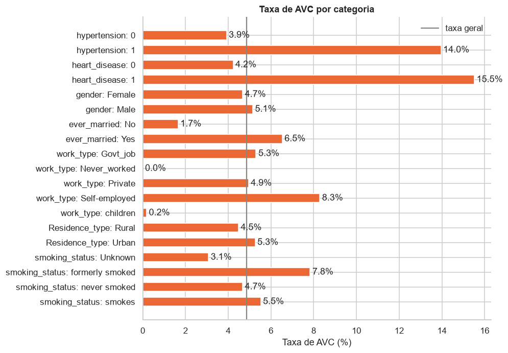

Todas as associações são significativas, exceto gênero e tipo de residência. As mais fortes são hipertensão e doença cardíaca, mas mesmo essas são fracas (V abaixo de 0,15), o que antecipa a dificuldade da classificação.

### Controlando a idade

A idade é o fator mais ligado ao AVC e também varia muito entre as categorias (crianças nunca casaram, autônomos são mais velhos). Para separar os efeitos, a taxa de AVC é comparada **dentro de cada faixa etária**:

| Variável | Categoria | Até 40 anos | 41 a 60 anos | Mais de 60 anos |
|---|---|---|---|---|
| hypertension | sem | 0,1% | 4,0% | 11,8% |
| | com | 2,9% | **9,0%** | **18,8%** |
| heart_disease | sem | 0,2% | 4,4% | 12,5% |
| | com | 0,0% | **9,8%** | **17,3%** |
| ever_married | nunca casou | 0,2% | 4,8% | 20,0% |
| | já casou | 0,2% | 4,6% | 12,7% |
| work_type | privado | 0,1% | 5,0% | 14,0% |
| | público | 0,0% | 4,1% | 12,1% |
| | autônomo | 1,1% | 3,4% | 12,7% |
| smoking_status | nunca fumou | 0,0% | 3,6% | 13,2% |
| | ex-fumante | 0,6% | 4,2% | 14,7% |
| | fuma | 0,5% | 6,6% | 11,6% |
| | desconhecido | 0,1% | 4,8% | 12,7% |

Dentro de cada faixa, as diferenças de estado civil, tipo de trabalho e tabagismo praticamente desaparecem; as de hipertensão e doença cardíaca permanecem.

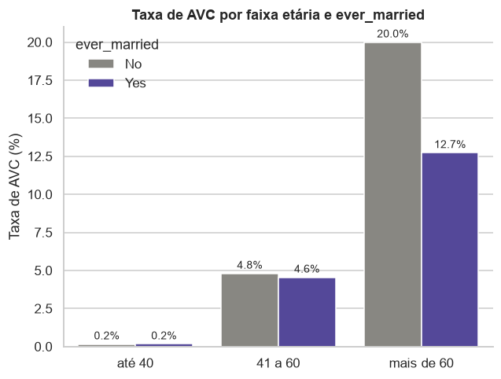

Casados e não casados têm a mesma taxa dentro de cada faixa, e acima dos 60 anos a relação até se inverte. A diferença geral (6,5% contra 1,7%) vem da idade: mediana de 54 anos entre casados e 18 entre os demais. É um exemplo do **paradoxo de Simpson**: uma associação que aparece no agregado e some (ou inverte) nos subgrupos.

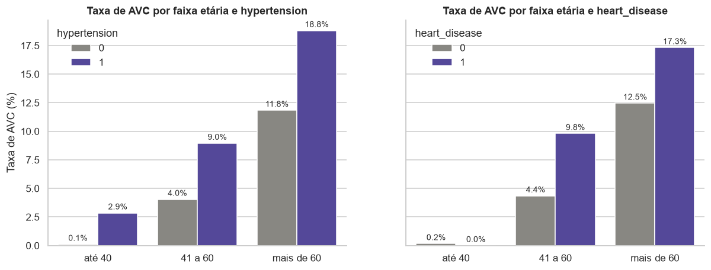

Hipertensão e doença cardíaca elevam a taxa em todas as faixas: entre 41 e 60 anos ela dobra, e acima dos 60 sobe de 12% para 17% a 19%. São fatores de risco próprios, além da idade.

### Variáveis numéricas × target

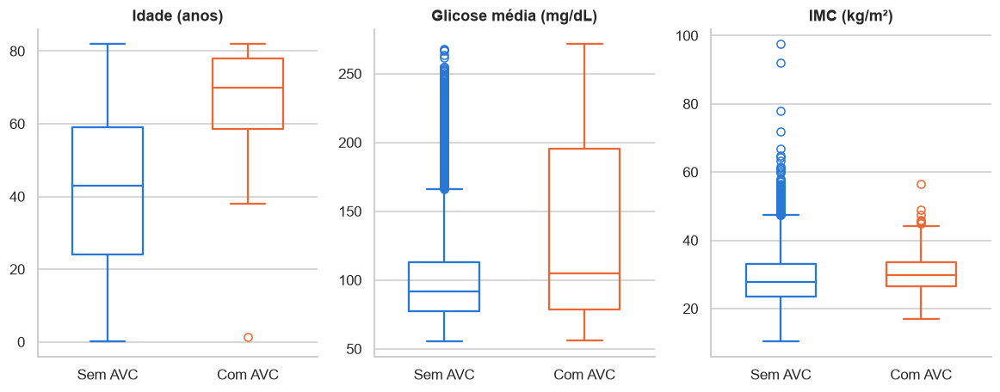

| Variável | Mediana com AVC | Mediana sem AVC | p-valor (Mann-Whitney) |
|---|---|---|---|
| Idade | 70,0 | 43,0 | < 0,001 |
| Glicose | 104,9 | 91,6 | < 0,001 |
| IMC | 29,9 | 27,9 | < 0,001 |

A idade é o que mais separa as classes. A glicose muda pouco na mediana, mas o quartil superior dos casos de AVC chega a 195, e um terço deles está acima de 170. O IMC quase não muda. O teste de Mann-Whitney (não paramétrico, adequado a distribuições assimétricas) confirma diferença significativa nas três, mas com magnitudes muito diferentes.

### Glicose e IMC em faixas clínicas

Taxa de AVC por faixa de glicose e faixa etária:

| Glicose (mg/dL) | Até 40 anos | 41 a 60 anos | Mais de 60 anos |
|---|---|---|---|
| até 100 | 0,3% | 3,5% | 11,0% |
| 100 a 126 | 0,0% | 3,9% | 11,7% |
| 126 a 170 | 0,0% | 4,4% | 16,7% |
| acima de 170 | 0,0% | **10,4%** | **18,5%** |

Controlando a idade, a glicose acima de 170 ainda eleva o risco: triplica entre 41 e 60 anos e sobe 7 pontos acima dos 60.

Taxa de AVC por faixa de IMC (classificação da OMS), só adultos:

| Faixa de IMC | Pacientes | Taxa de AVC |
|---|---|---|
| abaixo do peso (< 18,5) | 34 | 2,9% |
| normal (18,5 a 25) | 699 | 4,1% |
| sobrepeso (25 a 30) | 1.050 | 5,1% |
| obesidade (≥ 30) | 1.473 | 5,3% |

Só um leve aumento com o peso, coerente com a correlação quase nula.

### Tipo de trabalho

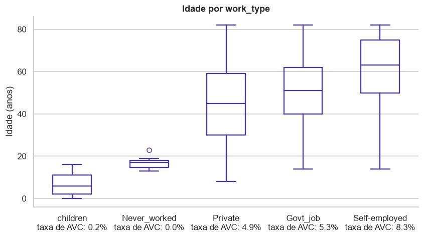

Ordenadas pela idade mediana, as categorias ficam também ordenadas pela taxa de AVC: crianças e quem nunca trabalhou são jovens e quase não têm AVC; autônomos são os mais velhos (mediana 63) e têm a maior taxa. Boa parte da variação do tipo de trabalho é idade.

### Tabagismo

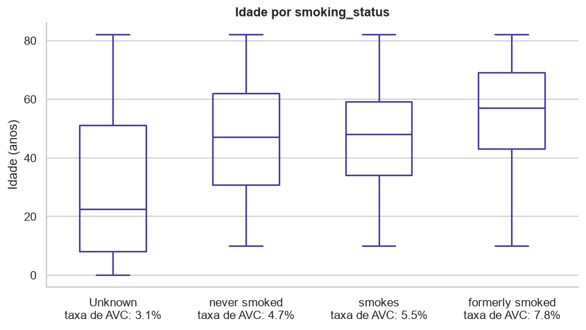

O grupo com status desconhecido é o mais jovem (mediana 22 anos): 90% das crianças estão nele, porque a pergunta não se aplica a elas. A maior taxa entre ex-fumantes acompanha a idade, já que é o grupo mais velho (mediana 57). O status desconhecido carrega informação (paciente jovem, risco baixo) e será mantido como categoria própria.

## Conclusões

1. Só 4,9% dos pacientes tiveram AVC; a acurácia não serve como métrica.
2. A idade é o fator dominante: mediana de 70 anos entre os casos e só 3 casos abaixo de 40.
3. Hipertensão, doença cardíaca e glicose acima de 170 elevam o risco mesmo dentro da mesma faixa etária.
4. Os outliers de glicose são um grupo real, com o triplo da taxa de AVC: devem ser mantidos.
5. Estado civil, tipo de trabalho e parte do tabagismo só parecem ligados ao AVC por causa da idade.
6. IMC, gênero e tipo de residência trazem pouca informação.
7. O IMC ausente e o tabagismo desconhecido não são aleatórios: devem virar informação, não ser descartados.
8. Nenhuma variável separa as classes sozinha; todas as associações são fracas.

Cada uma dessas conclusões vira uma decisão na página de [Pré-processamento](preprocessing.md).
