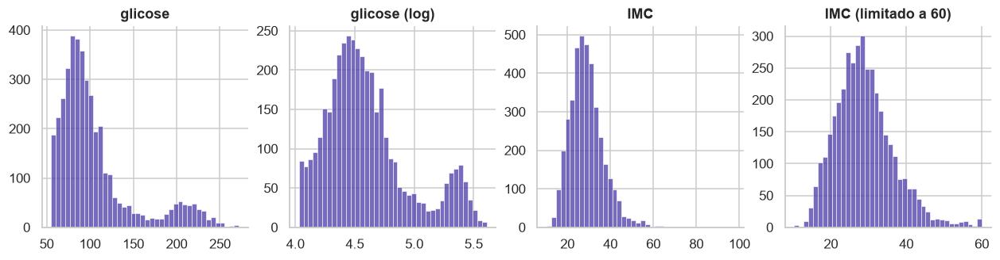
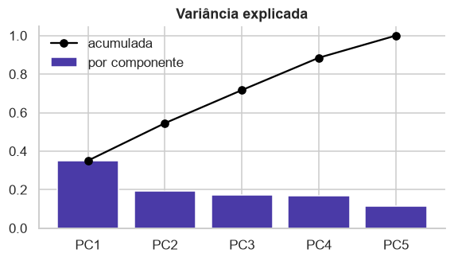
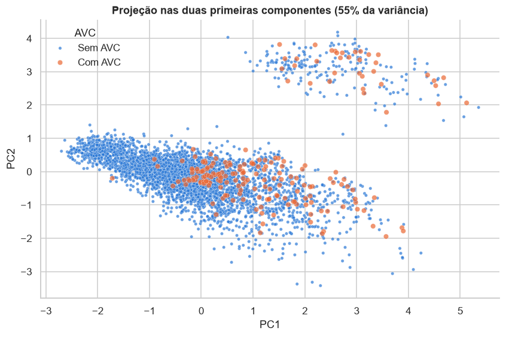
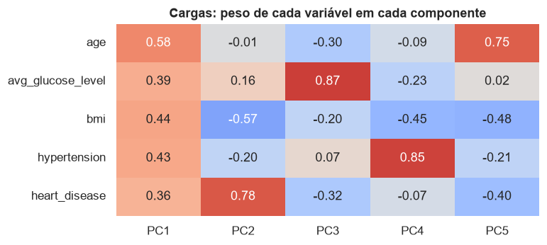

# Pré-processamento

Tarefa 4 da APS1. O código completo está no [notebook 02](https://github.com/mthperera/APS-ML/blob/main/notebooks/02_preprocessing.ipynb). Esta página explica **por que** cada etapa foi feita do jeito que foi: quais alternativas existiam, qual foi escolhida e qual achado da [análise exploratória](eda.md) sustenta a escolha.

## 1. Valores ausentes

**O que o dataset tem.** Só o IMC tem nulos: 163 pacientes no treino (3,9%) e 38 no teste. O tabagismo tem uma ausência disfarçada: a categoria "desconhecido", em 30% dos pacientes.

**Alternativas consideradas.**

| Alternativa | Por que não |
|---|---|
| remover as linhas sem IMC | a taxa de AVC entre elas é de 19,9%, contra 4,3% no restante: 40 dos 249 casos (16%) estão nesse grupo. Removê-las descartaria uma parte grande da classe rara e enviesaria o modelo para pacientes com menos risco |
| remover a coluna IMC | perde uma variável inteira por causa de 4% de nulos |
| imputar pela média | a cauda direita do IMC (valores até 97,6) puxa a média para cima; a mediana não é afetada |
| imputar tabagismo pela moda (nunca fumou) | transformaria um terço dos pacientes em não fumantes e apagaria o sinal de que a categoria concentra crianças (90% delas) |

**Decisão.** O IMC é imputado pela **mediana do treino** (28,1) e ganha uma **coluna indicadora de ausência**. O tabagismo desconhecido **fica como categoria própria**.

**Por quê.** A ausência do IMC não é aleatória: ela prevê o target. Se o valor fosse apenas imputado, essa informação se perderia; com o indicador, o modelo pode aprender que "IMC ausente" está associado a mais risco. A imputação em si quase não altera a distribuição (o desvio padrão vai de 7,90 para 7,74), porque são poucos valores e a mediana fica no centro. No tabagismo, o desconhecido carrega a informação "paciente jovem, risco baixo", que é útil para o modelo; como categoria própria, ele decide o que fazer com isso.

## 2. Outliers

**O que o dataset tem.** Pelo critério IQR, a glicose tem 489 outliers (12% do treino), o IMC tem 86 (2,2%) e a idade não tem nenhum.



**Alternativas consideradas.**

| Alternativa | Por que não |
|---|---|
| remover os outliers de glicose | eles não são erros: formam o segundo pico da distribuição bimodal, com perfil de diabetes, e têm **13,5% de AVC**, o triplo da taxa geral. Remover apagaria um dos sinais de risco mais fortes e 12% dos pacientes |
| remover os outliers de IMC | a maioria (IMC entre 47 e 60) é obesidade grave, plausível; só 12 valores passam de 60 |
| deixar tudo como está | a assimetria da glicose (1,58) prejudica modelos sensíveis à escala, e valores de IMC como 97,6 são erros de registro que distorcem média e desvio |

**Decisão.** Glicose: **manter todos os valores e aplicar log(1 + x)**. IMC: **limitar a 60** (clipping). Idade: nada.

| Variável | Assimetria antes | Assimetria depois | Máximo antes | Máximo depois |
|---|---|---|---|---|
| Glicose | 1,58 | 0,89 | 271,7 | 5,61 (escala log) |
| IMC | 1,12 | 0,80 | 97,6 | 60,0 |

**Por quê.** O logaritmo comprime a cauda direita e reduz a assimetria pela metade, mas preserva a ordem dos valores e o segundo pico, que é onde está o sinal. No IMC, valores acima de 60 são clinicamente implausíveis, mas os pacientes têm as outras variáveis válidas: o clipping mantém o paciente e elimina a influência do valor errado. Os IMCs abaixo de 15 são de crianças (idade mediana de 4,5 anos) e ficam como estão. As duas transformações são funções fixas, que não aprendem nada do treino, então não há risco de vazamento ao aplicá-las ao teste.

## 3. Encoding das variáveis categóricas

**O que o dataset tem.** Cinco variáveis categóricas, todas nominais (sem ordem natural), com no máximo cinco categorias cada.

**Alternativas consideradas.**

| Alternativa | Por que não |
|---|---|
| label encoding (uma coluna com 0, 1, 2, ...) | inventa uma ordem que não existe: o modelo trataria "autônomo" como maior que "setor privado", e a distância entre categorias como significativa |
| agrupar categorias raras | só "nunca trabalhou" é rara (16 pacientes); agrupar com outra categoria misturaria perfis diferentes sem necessidade, já que o one-hot lida bem com ela |

**Decisão.** **One-hot encoding**, com uma única coluna para as variáveis de duas categorias e tolerância a categorias novas. Resultado: 12 colunas.

| Variável | Colunas geradas |
|---|---|
| gender | gender_Male |
| ever_married | ever_married_Yes |
| work_type | work_type_Govt_job, work_type_Never_worked, work_type_Private, work_type_Self-employed, work_type_children |
| Residence_type | Residence_type_Urban |
| smoking_status | smoking_status_Unknown, smoking_status_formerly smoked, smoking_status_never smoked, smoking_status_smokes |

**Por quê.** O one-hot representa cada categoria como presença ou ausência, sem impor ordem, e a baixa cardinalidade mantém o número de colunas pequeno. Nas variáveis de duas categorias, uma coluna basta (a segunda seria o complemento exato da primeira, redundância que atrapalha modelos lineares). O encoder é configurado para ignorar categorias desconhecidas em vez de falhar, o que protege a aplicação em dados novos, embora todas as categorias do teste já existam no treino.

## 4. Padronização das variáveis numéricas

**O que o dataset tem.** Três variáveis contínuas em escalas muito diferentes.

| Variável | Mínimo | Máximo | Desvio padrão | % dos pacientes abaixo da metade da escala |
|---|---|---|---|---|
| Idade | 0,1 | 82,0 | 22,6 | 45% |
| Glicose | 55,2 | 271,7 | 44,7 | 88% |
| IMC | 10,3 | 97,6 | 7,9 | 95% |

**Alternativas consideradas.**

| Alternativa | Por que não |
|---|---|
| não escalar | modelos baseados em distância (KNN, SVM) ou em gradiente (regressão logística) dariam mais peso à variável de maior escala, a glicose, só por causa da unidade |
| Min-Max (levar para 0 a 1) | usa o mínimo e o máximo como referência, e os máximos de glicose e IMC são valores extremos: 88% dos pacientes ficariam na metade inferior da escala da glicose e 95% na do IMC, comprimindo quase todos os dados num intervalo pequeno |

**Decisão.** **Padronização** (StandardScaler: média 0, desvio padrão 1) nas três contínuas, calculada só no treino. As colunas 0/1 (binárias e one-hot) não são escaladas.

**Por quê.** A padronização usa média e desvio, que são muito menos sensíveis a um único valor extremo do que o máximo. Depois do log na glicose e do clipping no IMC, as distribuições ficam próximas de simétricas, e a padronização deixa as três variáveis comparáveis. As colunas 0/1 já estão numa escala comparável e padronizá-las só tornaria os coeficientes mais difíceis de interpretar.

## 5. Redução de dimensionalidade (PCA)

**O que foi feito.** PCA sobre as três contínuas (glicose com log, IMC limitado e imputado) e as duas binárias, todas padronizadas.

**Decisões dentro do PCA e o porquê.**

| Decisão | Por quê |
|---|---|
| incluir as binárias (hipertensão, doença cardíaca) além das contínuas | são numéricas (0/1) e as duas features mais associadas ao AVC depois da idade; sem elas, a projeção não mostraria a estrutura que elas criam |
| padronizar antes | o PCA maximiza variância; sem padronizar, a variável de maior escala dominaria a primeira componente |
| aplicar log e clipping antes | os valores extremos de glicose e IMC puxariam as componentes para si |
| imputar antes | o PCA não aceita valores ausentes |
| não usar o PCA para reduzir features na modelagem | as variáveis são pouco correlacionadas: são necessárias quatro componentes para 88% da variância, então comprimir não ganha quase nada e perde interpretabilidade |



| Componente | Variância explicada | Acumulada |
|---|---|---|
| PC1 | 35,0% | 35,0% |
| PC2 | 19,5% | 54,5% |
| PC3 | 17,2% | 71,7% |
| PC4 | 16,8% | 88,5% |
| PC5 | 11,5% | 100% |

As duas primeiras componentes explicam 55% da variância. Isso é pouco para cinco variáveis e confirma o que a matriz de correlação já mostrava: não há redundância entre as features, cada uma traz informação própria.

## 6. Análise dos resultados do PCA

### Separabilidade das classes



| Faixa de PC1 | Pacientes | Taxa de AVC |
|---|---|---|
| até −1 | 917 | 0,1% |
| −1 a 0 | 1.346 | 1,7% |
| 0 a 1 | 995 | 6,6% |
| 1 a 2 | 490 | 10,0% |
| acima de 2 | 339 | **17,7%** |

A primeira componente ordena o risco: a taxa de AVC cresce monotonicamente de 0,1% na faixa mais baixa para 17,7% na mais alta, uma diferença de mais de cem vezes. Mas as classes **não são separáveis**: quase metade dos casos de AVC está na mesma região da maioria dos pacientes sem AVC, e não existe nenhum agrupamento formado só por casos de AVC. O grupo isolado no alto do gráfico são os pacientes com doença cardíaca, separados pela segunda componente, e mesmo ali a maioria não teve AVC.

O que isso significa para a modelagem: nenhuma combinação linear simples das features separa as classes, então o modelo vai precisar estimar probabilidades de risco em vez de traçar uma fronteira, e a escolha do limiar de decisão vai importar tanto quanto a escolha do algoritmo.

### Importância das features



As cargas mostram o peso de cada variável em cada componente:

- **PC1** tem pesos positivos em todas as variáveis, com o maior na idade: é um eixo de "risco geral", que cresce junto com idade, glicose, IMC, hipertensão e doença cardíaca. Como é o eixo que ordena a taxa de AVC, a idade é a feature mais informativa.
- **PC2** opõe doença cardíaca a IMC: separa os cardíacos do restante.
- **PC3** é quase só glicose e **PC4** quase só hipertensão: essas duas variáveis carregam informação que não se mistura com as outras.

Conclusão: a idade domina, mas glicose, hipertensão e doença cardíaca trazem informação própria, não redundante. É coerente com a análise exploratória, em que essas três elevam a taxa de AVC mesmo dentro da mesma faixa etária.

## 7. Pipeline de pré-processamento

**Alternativa considerada.** Aplicar as transformações uma a uma com pandas, salvando os resultados. Foi descartada por três motivos: é fácil vazar informação (calcular uma mediana no dataset inteiro, por exemplo); as mesmas transformações teriam de ser reescritas para aplicar a dados novos; e não funciona dentro de validação cruzada, em que o pré-processamento precisa ser refeito a cada dobra.

**Decisão.** Um ColumnTransformer do scikit-learn, que aplica cada tratamento à sua coluna, com Pipelines internos onde há mais de uma etapa:

```python
log = FunctionTransformer(np.log1p, feature_names_out="one-to-one")
limitar = FunctionTransformer(np.clip, kw_args={"a_min": None, "a_max": 60}, feature_names_out="one-to-one")

preprocessador = ColumnTransformer([
    ("idade", StandardScaler(), ["age"]),
    ("glicose", make_pipeline(log, StandardScaler()), ["avg_glucose_level"]),
    ("imc", make_pipeline(limitar, SimpleImputer(strategy="median"), StandardScaler()), ["bmi"]),
    ("imc_ausente", MissingIndicator(), ["bmi"]),
    ("binarias", "passthrough", ["hypertension", "heart_disease"]),
    ("categoricas", OneHotEncoder(drop="if_binary", handle_unknown="ignore", sparse_output=False),
     ["gender", "ever_married", "work_type", "Residence_type", "smoking_status"]),
], verbose_feature_names_out=False).set_output(transform="pandas")

X_train_prep = preprocessador.fit_transform(X_train)
X_test_prep = preprocessador.transform(X_test)
```

**Por que assim.**

- **fit_transform no treino, transform no teste:** as medianas, médias, desvios e categorias são aprendidos uma única vez, no treino, e reutilizados. É o que garante que o teste não contamina nada.
- **A ordem dentro do IMC importa:** primeiro o clipping, depois a imputação, depois a padronização. Se a imputação viesse antes, a mediana seria calculada com os valores errados; se a padronização viesse antes do clipping, o valor 97,6 distorceria a média e o desvio.
- **O indicador de ausência é um ramo separado** porque precisa olhar o IMC original, antes da imputação.
- **Nomes de colunas preservados** (saída em pandas): o resultado é legível e permite interpretar coeficientes e importâncias na APS2.
- **Reutilizável:** o mesmo objeto pode ser encadeado com um classificador em um único Pipeline, e aí a validação cruzada refaz o pré-processamento dentro de cada dobra automaticamente.

**Verificação.** O resultado tem 18 features (3 contínuas, 1 indicador, 2 binárias, 12 do one-hot), nenhum valor ausente no treino nem no teste, e as contínuas com média 0 e desvio 1.

**Por que 18 features não é problema.** São 4.087 pacientes de treino para 18 colunas, mais de 200 por feature; a dimensionalidade só começa a pesar com centenas de colunas. O one-hot vira problema com variáveis de alta cardinalidade (dezenas de categorias), e aqui a maior tem cinco. Nem todas as 18 carregam sinal (gênero e residência não têm associação com o target, e as colunas de work_type são quase um proxy de idade), mas mantê-las custa pouco, e a regularização dos modelos lida com isso. O que vai limitar o modelo é a sobreposição das classes, não o número de features.

## Resumo das decisões

| Etapa | Evidência na análise | Decisão |
|---|---|---|
| IMC com 3,9% de nulos, não aleatórios | 19,9% de AVC entre quem não tem IMC | imputar pela mediana e criar um indicador de ausência |
| tabagismo desconhecido em 30% dos pacientes | 90% das crianças estão nessa categoria | manter como categoria própria |
| outliers de glicose (12%) | são o grupo com glicose alta, com 13,5% de AVC | manter e aplicar logaritmo |
| IMC implausível (acima de 60) | 12 casos no treino, chegando a 97,6 | limitar a 60 |
| categóricas nominais | nenhuma tem ordem natural | one-hot encoding |
| escalas diferentes | idade até 82, glicose até 272 | padronização (média 0, desvio 1) |
| PCA | quatro componentes para 88% da variância; PC1 ordena o risco | só para visualização; sem separação clara das classes |
| pipeline | evita vazamento e permite validação cruzada | ColumnTransformer ajustado só no treino |
| target raro (4,9%) | prever sempre "não" acerta 95% | split estratificado; na APS2, métricas para a classe rara |

## Saídas geradas

| Arquivo | Conteúdo |
|---|---|
| data/processed/train.csv | 4.087 pacientes do treino, dados originais |
| data/processed/test.csv | 1.022 pacientes do teste, dados originais |
| data/processed/train_processed.csv | treino após o pipeline: 18 features + stroke |
| data/processed/test_processed.csv | teste após o pipeline: 18 features + stroke |

Os arquivos não são versionados (o dataset é de uso educacional restrito), mas são regenerados ao executar os notebooks.